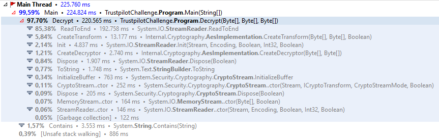
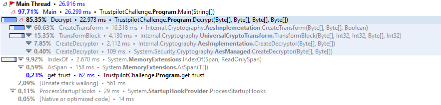

> This is the first (and maybe least interesting) post of a small series on AES-NI and .NET Core hardware intrinsics. The [next post](https://ndportmann.com/aes-ni-key-expansion/) starts to take a deep dive into AES-NI. This one is more about efficiently using the existing crypto APIs in .NET.

## Motivation

I was researching [AES New Instructions (AES-NI)](https://software.intel.com/sites/default/files/article/165683/aes-wp-2012-09-22-v01.pdf) and the support for [hardware intrinsics in .NET Core 3.0](https://devblogs.microsoft.com/dotnet/using-net-hardware-intrinsics-api-to-accelerate-machine-learning-scenarios/) when i stumbled over [this repository](https://github.com/ronnieholm/Playground/tree/master/TrustpilotAesChallenge) comparing different implementations of a [coding challenge](http://followthewhiterabbit.trustpilot.com/challenge2.html) from [Trustpilot](https://www.trustpilot.com/). What puzzled me most, was the fact that the .NET Core implementation took 6 minutes to complete, while an implementation in C only required 9 seconds (a factor of 40 slower!). I wouldn't have been surprised if a well optimized native implementation of a given problem is faster than the equivalent managed implementation in C#, but the factor was just way too high. So I started to tweak the code (first a little, then a LOT) and ended up with a solution that outperformed the implementation in C. However, this post is only about the first ~9x improvement, with more to follow as promised above.

## The challenge

```
We have a message for you.
It’s 3ncryp73d and we want you to crack it.
The decrypted message will contain further instructions.

Knowns:
- The algorithm is AES (Rijndael)
- Blocksize: 128
- Keysize: 256
- You only need to find the first 6 bytes of the key, the rest are 0’s, so:
    [?,?,?,?,?,?,0,0,0,0,0,0,0,0,0,0,0,0,0,0,0,0,0,0,0,0,0,0,0,0,0,0]
- All bytes in the key has an integer value between 0 and 16.
- The initialization vector is (base64 encoded): "DkBbcmQo1QH+ed1wTyBynA=="
- The text is just plain ASCII english

The encrypted text (base64 encoded):

yptyoDdVBdQtGhgoePppYHnWyugGmy0j81sf3zBeUXEO/LYRw+2XmVa0/v6YiSy9Kj8gMn/gNu2I7dPmfgSEHPUDJpNpiOWmmW1/jw/Pt29Are5tumWmnfkazcAb23xe7B4ruPZVxUEhfn/IrZPNZdr4cQNrHNgEv2ts8gVFuOBU+p792UPy8/mEIhW5ECppxGIb7Yrpg4w7IYNeFtX5d9W4W1t2e+6PcdcjkBK4a8y1cjEtuQ07RpPChOvLcSzlB/Bg7UKntzorRsn+y/d72qD2QxRzcXgbynCNalF7zaT6pEnwKB4i05fTQw6nB7SU1w2/EvCGlfiyR2Ia08mA0GikqegYA6xG/EAGs3ZJ0aQUGt0YZz0P7uBsQKdmCg7jzzEMHyGZDNGTj0F2dOFHLSOTT2/GGSht8eD/Ae7u/xnJj0bGgAKMtNttGFlNyvKpt2vDDT3Orfk6Jk/rD4CIz6O/Tnt0NkJLucHtIyvBYGtQR4+mhbfUELkczeDSxTXGDLaiU3de6tPaa0/vjzizoUbNFdfkIly/HWINdHoO83E=


Trustpilot Development Team
Biting the red pill
```

> Trustpilot: http://followthewhiterabbit.trustpilot.com/challenge2.html

## Analyzing the Performance Bottleneck

The idea behind the original implementation is quite smart and remained the same throughout my optimization attempts. The gist of it is "Let's decrypt the given ciphertext using all possible keys matching the description from the challenge and verify whether the result is readable by searching for the word "trust" in the resulting plaintexts."

The original implementation consists of a call to the following method in the inner loop of its `Main` method.

```csharp
static string Decrypt(byte[] cipherText, byte[] key, byte[] iv)
{
    var decryptor = aes.CreateDecryptor(key, iv);
    using (var ms = new MemoryStream(cipherText))
    using (var cs = new CryptoStream(ms, decryptor, CryptoStreamMode.Read))
    using (var sr = new StreamReader(cs))
        return sr.ReadToEnd();
}
```

A simple enough method decrypting a given `cipherText` with a provided `key` and `iv` using AES (CBC without padding). Running this implementation with a profiler attached revealed the following numbers.



85% of the time is spent in `StreamReader`s `ReadToEnd` method! So what if we could come up with an approach that could operate on the raw bytes returned by the decryption, instead of converting it into a `string`? Well, we could save a lot of time, that's what. 

## Initial improvements

I rewrote the `Decrypt` method to accept a `plaintext` buffer to hold the result. This helps avoid allocations, as the buffer can be reused in all iterations. 

```csharp
static void Decrypt(byte[] cipherText, byte[] plaintext, byte[] key, byte[] iv)
{
    var decryptor = aes.CreateDecryptor(key, iv);
    decryptor.TransformBlock(cipherText, 0, cipherText.Length, plaintext, 0);
}
```

The check if the resulting `plaintext` contains the word "trust" is now no longer possible via `String.Contains` but still simple enough, using the highly optimized methods provided on `Span<byte>`.

```csharp
private static ReadOnlySpan<byte> trust => 
    new byte[] {0x74, 0x72, 0x75, 0x73, 0x74};

private static bool ContainsTrust(byte[] plaintext) =>
    plaintext.AsSpan().IndexOf(trust) >= 0;
```

With all of that in place, I re-ran the tool again with the profiler attached and sure enough, we now spend 85% of the time in the crypto functions of the framework, instead of doing conversions. Avoiding allocations and `string`s is almost always a good idea if you aim for high performance.



So I was happy for the day and opened a [PR](https://github.com/ronnieholm/Playground/pull/1) but I also realized, that the frameworks AES implementation isn't really designed to perform crypto operations on relatively small messages using constantly changing keys. The [next post](https://ndportmann.com/aes-ni-key-expansion/) of this series focuses on how to work around exactly that issue.