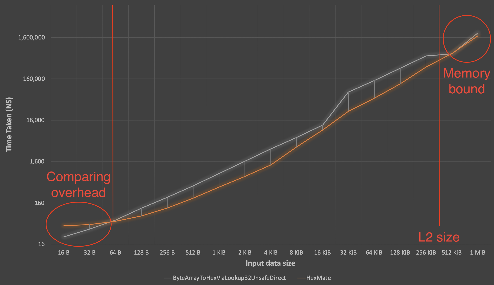

It all started over 10 years ago when someone dared to ask "[how to convert a byte array to a hexadecimal string?](https://stackoverflow.com/questions/311165/how-do-you-convert-a-byte-array-to-a-hexadecimal-string-and-vice-versa?answertab=oldest#tab-top)" over at Stack Overflow. The community quickly provided several very different answers. Some involved loops, some LINQ, others bent the available Framework-methods to their needs. Both bit fiddlers and lookup table magicians entered the field and presented their more and more unsafe solutions. [Adam Patridge](https://github.com/patridge) stepped in quite a bit later and benchmarked all submitted solutions.

Today - more than 10 years later - we are going to beat all previous records once again, utilizing the new secret sauce introduced in .NET Core 3.0: hardware intrinsics. But let's have a look at the current champion of hex encoding fist.

## The Current Champion

```csharp
static uint[] _Lookup32 = Enumerable.Range(0, 256).Select(i => 
{
    string s = i.ToString("X2");
    if(BitConverter.IsLittleEndian)
        return ((uint)s[0]) + ((uint)s[1] << 16);
    else
        return ((uint)s[1]) + ((uint)s[0] << 16);
}).ToArray();

static readonly uint* _lookup32UnsafeP =
    (uint*)GCHandle.Alloc(_Lookup32, GCHandleType.Pinned)
    .AddrOfPinnedObject();

static string ByteArrayToHexViaLookup32UnsafeDirect(byte[] bytes)
{
    var lookupP = _lookup32UnsafeP;
    var result = new string((char)0, bytes.Length * 2);
    fixed (byte* bytesP = bytes)
    fixed (char* resultP = result)
    {
        uint* resultP2 = (uint*)resultP;
        for (int i = 0; i < bytes.Length; i++)
            resultP2[i] = lookupP[bytesP[i]];
    }

    return result;
}
```

The process of encoding a `byte` into its hex representation converts one byte into two characters. Each character is a 16-bit value (`char`). The two characters representing a given byte, therefore, take up exactly 32-bits, the size of a `uint`. The first lines above create a lookup table for every one of the 256 possible `byte` values. The resulting table is exactly 1 KB in size and pinned in memory by the second group of lines to get a `uint*` (I'm sure you've noticed by now, that the entire snippet is `unsafe` C#). We'll talk more about this trick later, as there are downsides to consider at least until the [Pinned Heap](https://github.com/dotnet/coreclr/blob/master/Documentation/design-docs/PinnedHeap.md) GC-feature is ready.

The main method creates a right-sized string, takes its address using the `fixed` keyword and turns every input byte in its respective two-character hex representation using the pinned lookup table described above.

If you crave performance, this method does a couple of things very well:

* The one-time calculation of a lookup table is a typical memory vs. speed trade-off (investing 1 KB of memory for a significant speed-up can be a good thing).
* Permanently pinning the lookup table *potentially* reduces the method overhead, as it does not have to fix the lookup table on each invocation.
* Turing `_lookup32UnsafeP` into a local variable `lookupP` means the lookup of the static variable happens only once (instead of in the loop).
* Creating a right sized-string and working with it's pinned address avoids unnecessary copies. There even is a [fast-path](https://github.com/dotnet/coreclr/blob/5937becd8823312d6b2d490a4d977ec663def72d/src/System.Private.CoreLib/shared/System/String.cs#L280) for the chosen constructor if the first parameter is the zero/null `char`.

There are, however, downsides or potential improvements to almost all of the above optimizations:

* The lookup table is too large to reside in the cache closest to the processing units completely. This results in data-dependent execution times due to cache-misses.
* Keeping the lookup table pinned permanently causes trouble for the GC, as it will never be able to relocate the array and must work its way around it. An alternative would be to unpin the array in a `Dispose` method, or just pinning the array inside of the actual method.
* The `string.Create` method introduced in .NET Core 2.1 is even cleaner (more obvious) than the cleverly used string constructor.

## Benchmarking is Hard - Use BenchmarkDotNet

The original benchmarks are still on [GitHub](https://github.com/patridge/PerformanceStubs). It is worth noting, however that they were written in a time before [BenchmarkDotNet](https://benchmarkdotnet.org/). The .NET community today generally agrees to leave the setup and execution of benchmarks to BenchmarkDotnet instead of rolling your own. Luckily, the existing benchmark is easily portable to a BenchmarkDotNet project (as showcased over [here](https://github.com/tkp1n/HexMate/blob/blog/HexMate.Benchmarks/BlogBench.cs)).

The old benchmark used two text files as input for the various tested encoding algorithms. This is desirable to ensure consistent results. Unfortunately, the text files translate only to a subset of possible bytes as input to the algorithms (printable ASCII) which may favor branchy or lookup-based approaches. This is also easily improved by using `new Random(42).NextBytes(data)` as input. The constant seed ensures consistency, while `Random` pseudo-randomly produces all possible byte values.

Another potential issue with using files as input is their fixed size (in this case ,3.38 KB and 1.16 MB). BenchmarkDotnet allows for straightforward configuration of various input sizes [like so](https://github.com/tkp1n/HexMate/blob/b7f7e89252d2cc8a03f65e32566fcb4ce4963ee5/HexMate.Benchmarks/BlogBench.cs#L16). For a general-purpose algorithm such as hex encoding, I typically prefer to test on three sizes of input data:

* The first one small enough to almost exclusively test the overhead of the methods under test
* The second one small enough to ensure, input and output data can reside in a cache close to the processing units. This way, we make sure not to test memory bandwidth but the actual algorithm.
* The third one large enough to make sure any unexpected algorithmic complexity would show up in the results.

Below diagram shows the results of testing the current champion vs. my implementation [HexMate](https://github.com/tkp1n/HexMate) for a lot of different input sizes. Please note that the scales are not linear (logarithmic), which lets the differences appear smaller than they are. The chart does, however, showcase the three categories of input data sizes quite well. Below 64 bytes we are only comparing the overhead of the methods. Unsurprisingly comparing a raw conversion method vs. a library-like implementation (HexMate) with a bunch of input validation favors the raw method. In the second category, we see HexMate taking off 🚀 and completing the job **twice as fast** (-65.31% @ 32 KiB) as its competitor. All measurements above the size of the L2 cache of my MacBook seem to be bottlenecked by memory speed. This means that the algorithm for converting (in my case) more than 512 KiB of data does not matter, as long as it is faster than the reads/stores from/to memory.



## The Hardware Intrinsics Magic

Now that we studied the current Champion and discussed the benchmarking methodology it's time to look at HexMate. I started writing HexMate as a playground to explore the new hardware intrinsics API and as an implementation of my [API proposal](https://github.com/dotnet/corefx/issues/10013#issuecomment-511112311) for .NET Core. It is apparent that hex encoding/decoding algorithms will likely always be $O(n)$, so how do we improve upon the current Champion encoding a byte to two characters using two lookups? We work on multiple bytes at once using SIMD (single instruction, multiple data) instructions! The SSE instructions allow us to work on 16 bytes at a time, while AVX even works on 32-byte vectors. The following snippet is the main part of the inner loop of HexMates UTF-8 hex encoding algorithm using SSSE3 (full source [here](https://github.com/tkp1n/HexMate/blob/master/HexMate/Formatter/Utf8/Utf8HexFormatter.Ssse3.cs)).

The first three lines isolate the high (`hiHalf`) and the low (`loHalf`) nibbles of each byte in the given `input` vector. Using `UnpackHigh` and `UnpackLow` (`punpckhbw` and `punpcklbw`), the isolated nibbles are arranged (interleaved) in the proper order. The `Shuffle` instruction (`pshufb`) performs a 16-byte lookup to translate the input nibbles into the desired UTF-8 codepoints (0x0A -> 0x41, 0x06 -> 0x36).

```csharp
var hiShift = ShiftRightLogical(input.AsInt16(), 4).AsByte();
var hiHalf = And(hiShift, x0F);
var loHalf = And(input, x0F);

var hi = UnpackHigh(hiHalf, loHalf);
var lo = UnpackLow(hiHalf, loHalf);

var resLeft = Shuffle(hexLookupTable, hi);
var resRight = Shuffle(hexLookupTable, lo);
```

HexMate supports UTF-8 and UTF-16 encoding and validating decoding (both upper- and lowercase) using the following instruction sets to enable maximum performance on all modern (non-ARM, non-exotic) CPUs:

|              | **SSE2** | **SSE41** | **SSSE3** | **AVX2** |
|--------------|:--------:|:---------:|:---------:|:--------:|
| **Encoding** |     ✅    |     ❌      |     ✅     |     ✅    |
| **Decoding** |     ✅    |     ✅     |     ✅     |     ✅    |

Make sure to check out its source code on [GitHub](https://github.com/tkp1n/HexMate) as well as the available [NuGet Package](https://www.nuget.org/packages/HexMate/). But most importantly; leave a vote or comment on [corefx Issue 10013](https://github.com/dotnet/corefx/issues/10013) to finally make hex encoding/decoding a part of the .NET framework.
