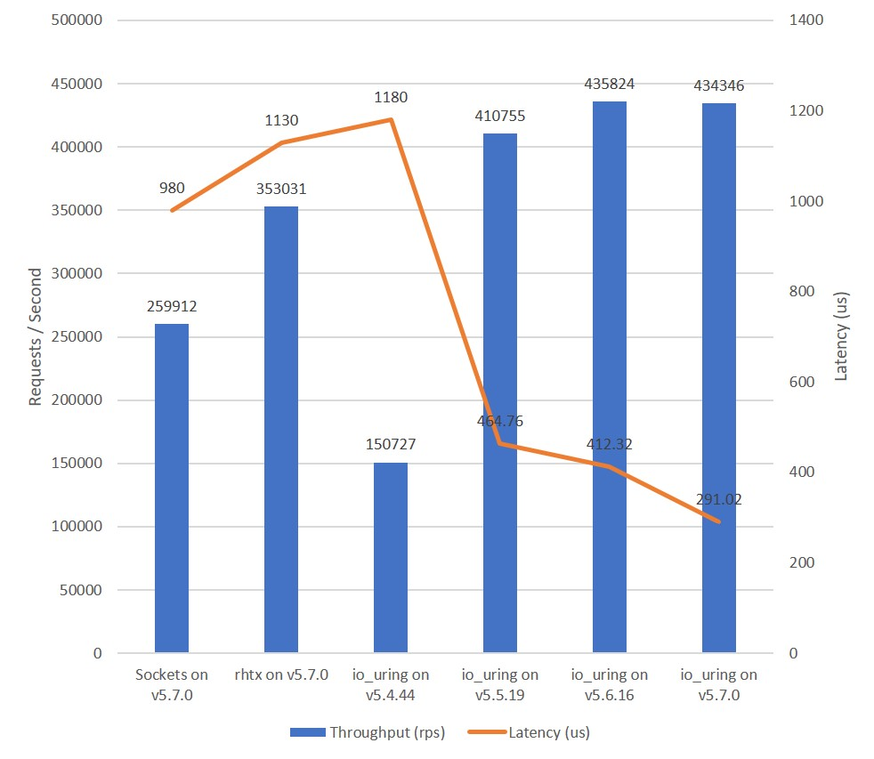

Round 19 of the TechEmpower Benchmarks just completed, and ASP.NET [topped the charts](https://www.techempower.com/benchmarks/#section=data-r19&hw=ph&test=plaintext) for the "Plaintext" type of tests. In fact, quite a few platforms are able to [saturate 10GbE at 7+ million request/s](https://www.ageofascent.com/2019/02/04/asp-net-core-saturating-10gbe-at-7-million-requests-per-second/), which could lead us to think that there is no room for improvements. I beg to differ.

A new set of APIs for I/O in the Linux Kernel called `io_uring` promise to improve things once again significantly, as detailed in the previous parts ([I](https://ndportmann.com/io_uring-rationale/) and [II](https://ndportmann.com/io_uring-foundation/)) of this series. `io_uring` was introduced in version 5.1 of the kernel, and its capabilities have [grown rapidly](https://lwn.net/Articles/810414/) over the past releases. Unfortunately, the performance and features required to compete in the webserver business came shortly after the current longterm kernel release v5.4. But the long-awaited features are here now (in stable releases) and worth taking a look at.

Over the last couple of months, we've developed a new Transport Layer for ASP.NET based on `io_uring` called [**IoUring.Transport**](https://github.com/tkp1n/IoUring.Transport), which is now available as a preview release on [NuGet.org](https://www.nuget.org/packages/IoUring.Transport). In this post, we look at initial benchmark results and close with some thoughts about the future.

## Benchmark Results

### Methodology

All benchmarks were conducted on my notebook (Lenovo X1 Extreme Gen 2: Intel i7-9750H (6 Core / 12 Thread) with 32 GB RAM) running Windows 10 (2004). Both the load generator (`wrk`) and the web servers were run in the same Ubuntu Server 20.04 Hyper-V VM with 12 logical cores and 8 GB of RAM assigned. 

The load tests executed for 10 minutes per configuration using 128 concurrent connections over 6 threads: 

```
wrk -t 6 -c 128 -d 600s http://localhost:8080/p
```

The configurations under test are a fork of the ASP.NET [PlatformBenchmarks](https://github.com/TechEmpower/FrameworkBenchmarks/tree/master/frameworks/CSharp/aspnetcore/PlatformBenchmarks) from the TechEmpower repository adjusted to include the `io_uring` based Transport Layer ([see here](https://github.com/tkp1n/IoUring.Transport/tree/master/tests/PlatformBenchmarks)). The .NET runtime for all configurations is: 5.0.100-preview.4.20258.7.

I am aware that this setup is far from optimal, but I currently don't have the resources (e.g., a 10GbE switch) to perform more real-world testing. Feel free to suggest improvements or to help out at this [GitHub Issue](https://github.com/tkp1n/IoUring.Transport/issues/5).

### Results

Using above methodology, six configurations have been tested:

* **Socket-based Transport Layer** on **v5.7.0**
* **RedHat Transport Layer** (rhtx) on **v5.7.0**
* **IoUring.Transport** on **v5.4.44**
* **IoUring.Transport** on **v5.5.19**
* **IoUring.Transport** on **v5.6.16**
* **IoUring.Transport** on **v5.7.0**

The results displayed in the charts below show quite interesting findings:

* Using `io_uring` on kernels prior to v5.5 is **not profitable** for this scenario.
* On v5.7, `io_uring` delivers **23% more throughput and 74% less latency** than the current TechEmpower chart-topper "aspcore-rhtx".
* The throughput seems bottlenecked at roughly 435000 rps, as I would have expected another jump from v5.6 to v5.7 due to [IORING\_FEAT\_FAST\_POLL](https://git.kernel.dk/cgit/linux-block/commit/?h=for-5.7/io_uring&id=d7718a9d25a61442da8ee8aeeff6a0097f0ccfd6) (as seen [here](https://twitter.com/hielkedv/status/1234135064323280897?s=21)).



## The Future

### Connection Abstractions in the BCL

IoUring.Transport is based on the connection abstractions from ASP.NET ([Microsoft.AspNetCore.Connections.Abstractions](https://github.com/dotnet/aspnetcore/tree/master/src/Servers/Connections.Abstractions/src)). This means that all frameworks based on ["Project Bedrock"](https://github.com/dotnet/aspnetcore/issues/4772) (ASP.NET, Orleans, etc.) could profit from `io_uring`. There is currently an [API review](https://github.com/dotnet/runtime/issues/1793) ongoing for integrating those abstractions into the base class library. This would mean that any .NET application could profit form IoUring.Transport e.g., to perform HTTP calls at peak performance. I will migrate IoUring.Transport to the BCL connection abstractions, as soon as they are finalized and used by ASP.NET.

### Leveraging Buffer Selection

Buffer selection is a feature introduced to `io_uring` in version 5.7. It lets you provide a set of buffers to the kernel and then start `read` operations without specifying a buffer for the data to be read. Once data is available, the kernel will select one of the previously provided buffers to fulfill the `read` operation and let you know which buffer it chose. This way, you don't have to "block" one buffer per pending read operation that may not complete at all or only once the remote station has something to say.

[Initial tests have shown](https://twitter.com/hielkedv/status/1235223155666542594) that this feature - in its current state - is hurting the performance of web server scenarios quite a bit. I'll look into leveraging it in IoUring.Transport, once this has improved kernel-side.

From my understanding, this feature is meant to reduce the amount of actively used memory and not a feature to improve throughput (directly). It will therefore likely remain behind a feature flag, once it is implemented in IoUring.Transport.

### TechEmpower Benchmarks

It'll take some time until the servers used by the TechEmpower Benchmarks run a kernel >= v5.7. Don't expect to see results using this Transport layer anytime soon. But help is always appreciated to make sure we are ready with an `io_uring` based Transport, once the TechEmpower servers are ready. We don't want to fall behind, now that we are on top, do we? 😉

### Try it for Yourself!

As mentioned above, IoUring.Transport is now available as a preview release on [NuGet.org](https://www.nuget.org/packages/IoUring.Transport). The entire project is open source, and I'd love to hear your feedback on [GitHub](https://github.com/tkp1n/IoUring.Transport). 

Be aware, though, that this is a preview release of an experiment. Do **not** use this in production (yet).

### Comments

If you want to leave a comment about this blog post, please do so on [this](https://github.com/tkp1n/ndportmann.com/issues/2) GitHub issue. I plan to - at some time - add a comment section to this blog. For now, [this issue](https://github.com/tkp1n/ndportmann.com/issues/2) is all we have.